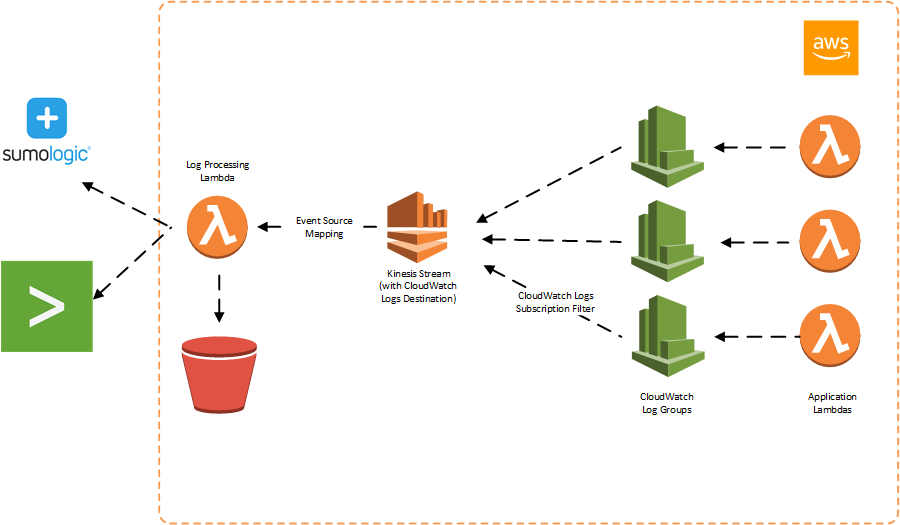

## Lambda Logging ##

Lambda is a fantastic service which provides a great platform for application development. It integrates with a range of AWS services from functional perspective (such as event source mapping with Kinesis and event based trigger for S3 and CloudWatch Events). It also provides operational and monitoring integration with CloudTrail, CloudWatch and X-Ray services. 

One the key areas every Lambda developer would be familiar with is how the service handles logging. AWS Lambda utilises CloudWatch logs for streaming of application logs directly from Lambda runtime.

## Aggregating Logs to a Kinesis Stream ##

Kinesis Stream provides a sequenced stream of data that retains records for up to 14 days. Kinesis Streams can be read multiple times by multiple consuming applications and acts as a great medium for real-time visualisaiton.

To enable Kinesis as a destination for logs from multiple Lambda functions we need to:
1. Create a Kinesis Stream to be used as a Log destination
2. Create an IAM role allowing CloudWatch Logs service  
3. Create a CloudWatch Logs Destination which targets the stream
4. Assign a CloudWatch Logs Subscription Filter to *each* CloudWatch Logs Group assign to a Lambda function

## Forwarding Logs from Kinesis to a third party service ##

When using a third-party aggregation solution (such as Splunk or ELK stack) we can extend our solution to provide real-time forwarding by assigning a log processing Lambda function to kinesis stream that acts as a broker to a third party service.

